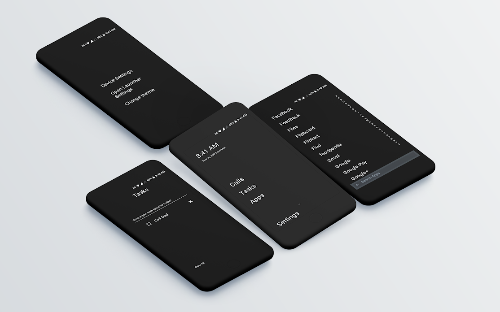
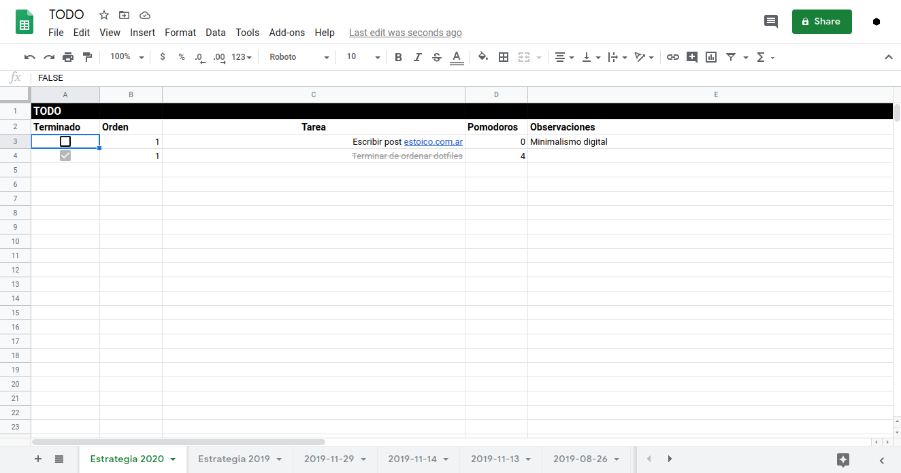

Quiero dar inicio este post con una frase de Séneca.

>> Compra sólo lo necesario, no lo conveniente. Lo innecesario, aunque cueste un solo céntimo, es caro.

Una de las **bases del estoicismo es la moderación**. Por lo tanto, creo que el
minimalismo es una conclusión lógica, es inevitable en la práctica estoica. Hoy
me voy a centrar en una de sus facetas: **minimalismo digital**.

Vivimos en la era de la información. Nunca en la historia de la humanidad se
pudo acceder (en general) a fuentes de conocimientos de manera tan masiva y
fácil. **Y con el acceso vino la sobrecarga**. Todo el mundo se convirtió en
productor de contenidos que pelea por nuestra atención. Que dicho de
otro modo, **es una lucha constante por nuestro tiempo**. Y el tiempo, en
definitiva, es vida.

Redes sociales, portales de noticias, Reddit, YouTube, Netflix... Destinan miles de millones
desarrollando algoritmos que **predicen nuestro gusto para mantenernos el mayor
tiempo posible en la plataforma**. Y si eso no fuera suficiente, con la llegada
de las aplicaciones de mensajería instantánea (WhatsApp, Telegram, etc) las
personas cercanas (y no tanto) también se suman a la competencia. _¿Quien se
anima, hoy día, a dejar una notificación sin leer?_.

Lo que me trae al motivo de este post, compartir las herramientas que
utilizo para no caer en la sobrecarga de información mientras sigo siendo un
miembro útil de la sociedad.

## La pulsera electrónica.

Voy a comenzar por el pequeño vampiro moderno que todos llevamos pegado... **el
móvil** (y sus apps). Si tu objetivo es tener una vida digital un poco más consciente, el
primer paso es **desinstalar todo programa que no aporte nada a nuestra
existencia**.  
Y las **redes sociales** son exactamente eso. Personalmente, no me es
necesario saber que hacen o dejan hacer conocidos y desconocidos todo el
tiempo. Lo mismo aplica para el resto de apps. **Si no aportan algún valor o hace mucho
que no las utilizo, las elimino**. Afortunadamente cuento con acceso a internet
para volver a descargarlas en caso de necesitarlas. De esta manera tengo menos 
distracciones y un teléfono ágil (_take that obsolescencia programada_).

Una herramienta que me encanta y me ayuda a mantener el móvil con accesos
ordenados en Android es [Indistractable Launcher](https://play.google.com/store/apps/details?id=com.indistractablelauncher.android).

Cómo se puede apreciar, tiene un diseño ultra minimalista, donde sólo se accede a un
limitado número de apps con el texto. Ni más ni menos. El resto de aplicaciones está
escondido por si lo necesitamos.

La última recomendación para usar eficientemente ~~la pulsera electrónica~~
el celular, es aprender a utilizar el modo **No molestar**,
específicamente las reglas de automatización. ¿Te pone nervioso ese sonido de
notificación?. Bueno, uno puede desactivar todas las
alertas en un rango de tiempo, evitando el estrés de tener que contestar
mensajes fuera de un horario determinado.

## Desktop y web en general.

Acá mi configuración se desvía de la media de los usuarios. Mi sistema
operativo para el día a día es Ubuntu, Lubuntu puntualmente. Para el que no lo conoce es una
variación (distro) de Linux. Y para rematar, utilizo `i3wm` cómo gestor de
ventanas. I3 es un administrador de ventanas minimalista que esta optimizado 
para ser usado sin mouse. **Esto me permite utilizar el teclado para manejar el 99% del sistema**.
Además trato aprender y utilizar los [atajos de los programas](https://logico.ar/blog/2019/01/29/una-vida-sin-mouse-o-como-aprendi-a-utilizar-el-teclado-para-todo) para no sacar las manos del teclado el mayor tiempo posible. 
Cómo programador, me da una gran ventaja de productividad.

En cuanto a navegadores utilizo Google Chrome y Opera. El primero con
un perfil de trabajo y el otro con uno personal. De esta manera evito que se
mezclen pestañas e historial de búsqueda. Utilizo 5 extensiones:

- Vimium: permite navegar los sitios con las teclas de Vim.
- uBlock: Elimina toda la publicidad y contenido de las webs.
- FasterChrome: Descarga los links donde se posa el mouse en segundo plano y da
    la sensación de aumento de velocidad de navegación.
- Pocket: Guardar artículos para leer más tarde.
- LastPass: Un administrador de contraseñas.

Para ir cerrando el artículo, cómo herramientas de productividad utilizo (tareas,
calendario, documentos, etc) Google Docs y Calendar. Esto me permite
sincronizar fácilmente teléfono y computadoras. Para tareas (_TODO_) tengo una
plantilla en Sheets donde almaceno las tareas importantes.

Un comentario final. Tanto en la vida analógica cómo en la digital, lo
importante es tener lo justo y necesario.

_See you, space cowboy._
