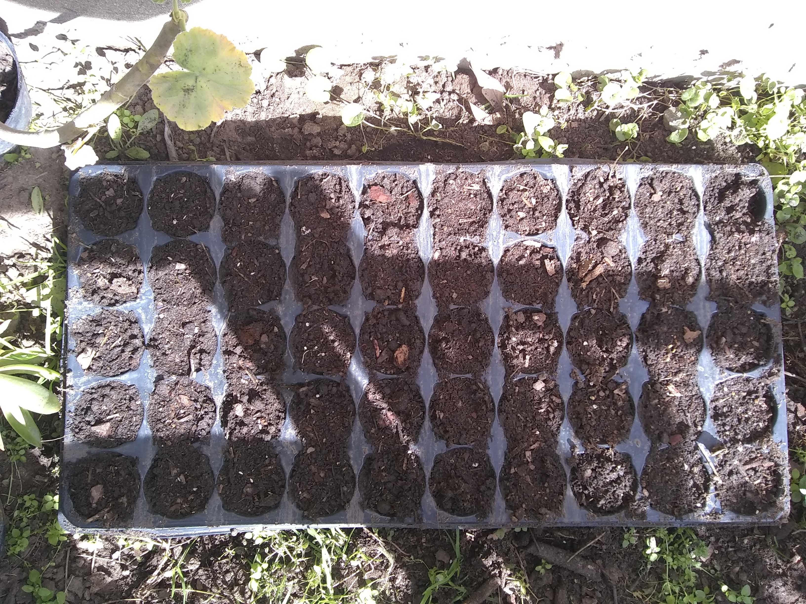
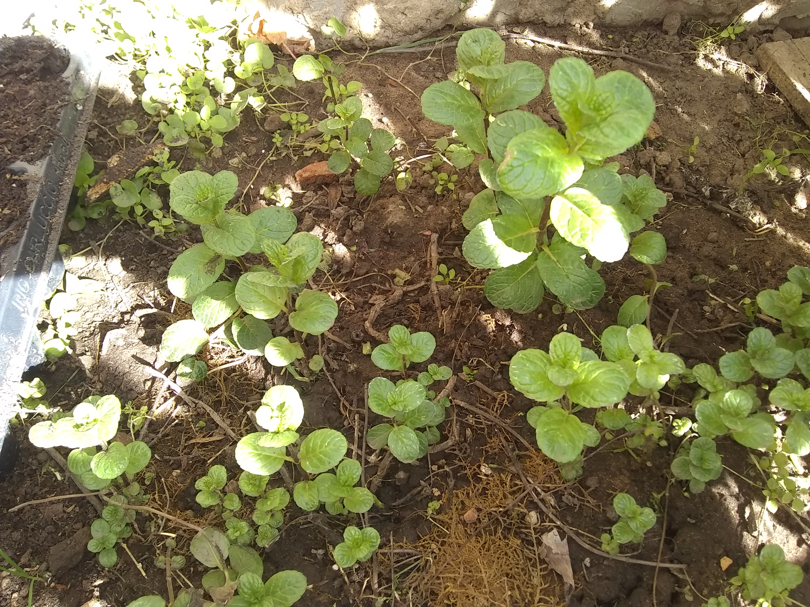
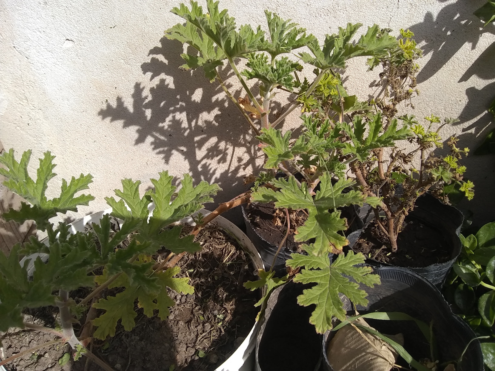

Finalmente, empieza a acercarse la primavera y hay que arrancar con los preparativos para la temporada.
Un poco de historia primero. Desde hace 3 años destiné un pedacito de patio, unos 15mts² (10 x 1.5), y ahí planto verduras que
consumimos. El primer año planté acelgas, rúculas y espinacas. Salieron bastante
bien y me dió ganas de continuar.

Continué con las plantas de hojas verde hasta el
verano que planté tomates, lechugas, melón y sandia. En 2018 tuve un
rendimiento muy bueno con 4 plantas de tomates: **coseché casi 1kg diario durante 2 meses**.
Un par de melones, sandias y las plantas de lechuga.

En primavera/verano 2020 no fue tan bien (vaticinio de lo que nos esperaba). Decidí
plantar melón, pepino y 3 variedades de tomates (me encanta el tomate): cherry, perita y redondo.
 Los pepinos nunca vieron la luz del día y las plantas de tomates agarraron una peste
que teñia las hojas de un color rojo y finalmente las terminaba matando.
En resumen, los perita tardaron muchísimo en madurar, pocos (y enfermos)
tomates redondos y sólo un melón.

Ahora en esta nueva temporada y con esperanzas renovadas preparé el semillero con:

- 15 plantas de lechuga mantecosa.
- 10 plantas de tomates redondo.
- 5 plantas de tomates cherry.
- 10 plantines de ciboulette.
- 10 plantines de albahaca.

Además ya tengo preparadas 2 plantas de citronella (una regalada 😆) y una menta
que dejé en tierra por el invierno pero veo que va a crecer demasiado. Así que
voy a tener que transplantarla a una maceta o un cajón.

### Portada

Photo by <a href="https://unsplash.com/@gallarotti?utm_source=unsplash&amp;utm_medium=referral&amp;utm_content=creditCopyText">Francesco Gallarotti</a> on <a href="https://unsplash.com/s/photos/seed?utm_source=unsplash&amp;utm_medium=referral&amp;utm_content=creditCopyText">Unsplash</a>
